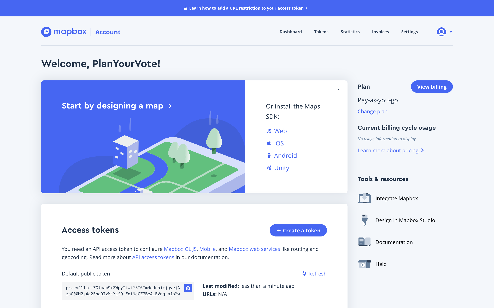
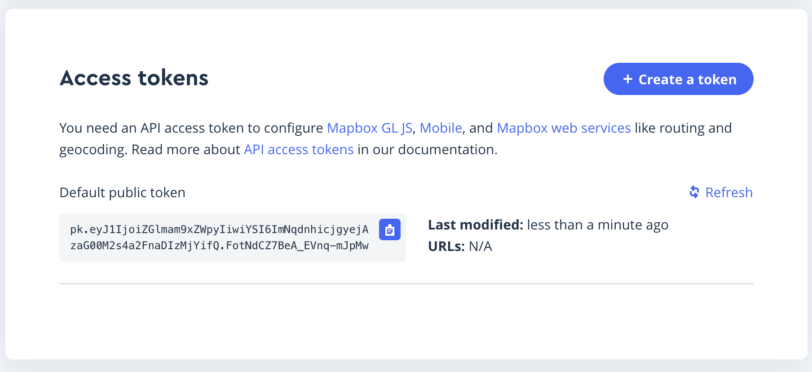
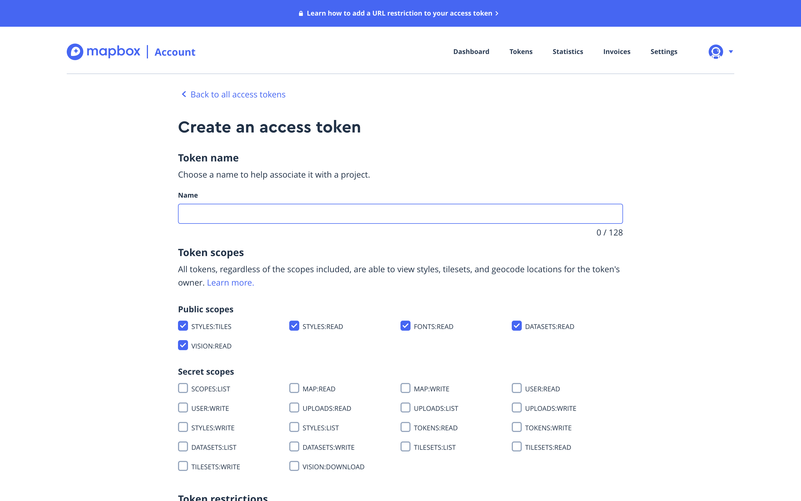
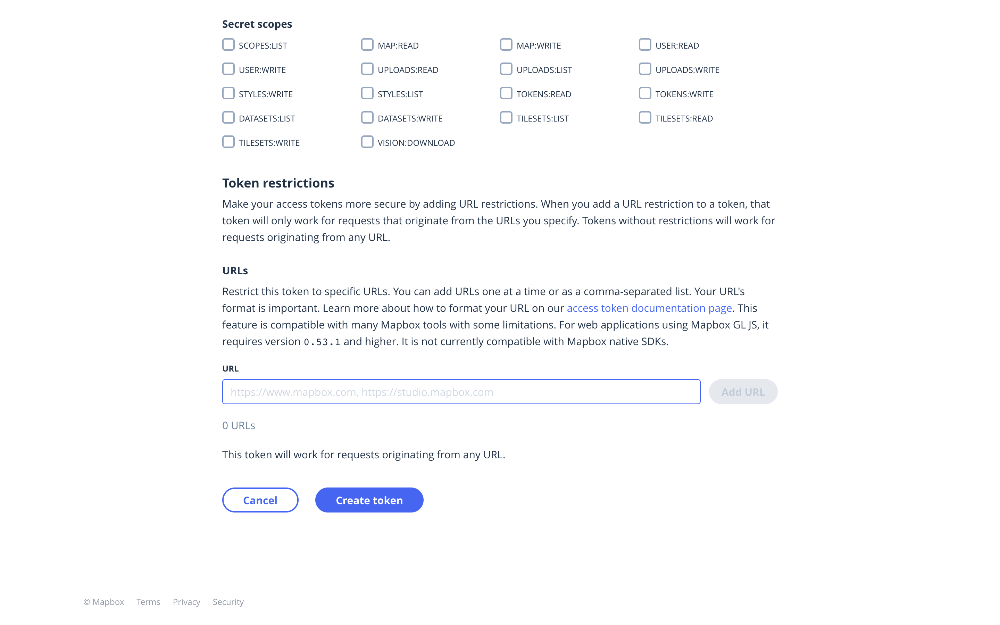
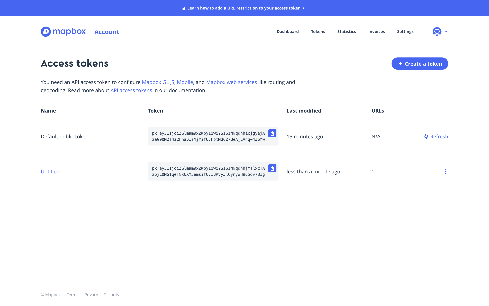
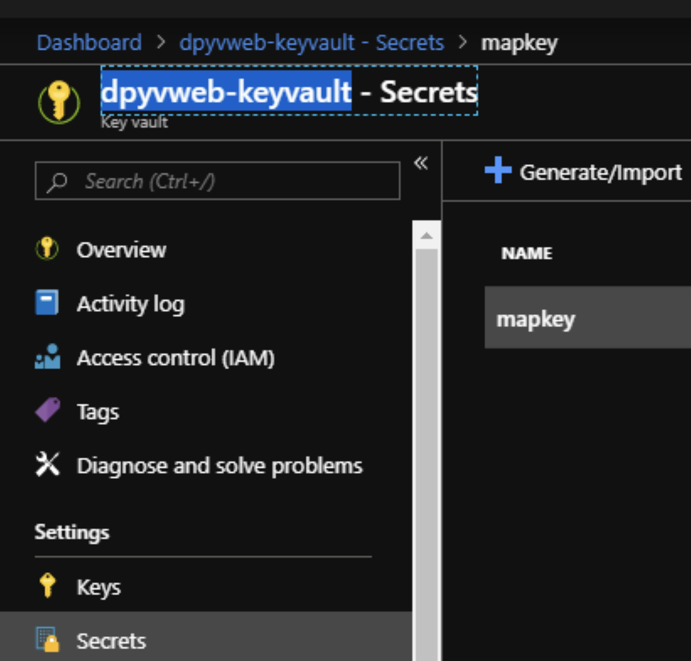
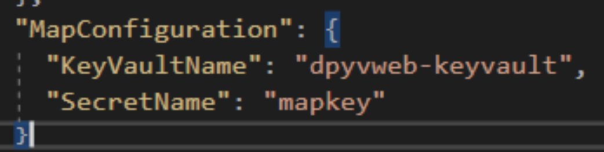

1. Go to [Mapbox](https://www.mapbox.com/) website
2. [Create an account](https://account.mapbox.com/auth/signup/)
3. Login
4. The screen will look like this: 
5. Copy the default token. [It will be used in your CMS.](#CMS) 
6. Click **Create a token** button.
7. Create a new token. Don't forget to add URL restrictions.
    
8. Copy the new token. [It will be used in your CDA.](#CDA) 

## CMS

### Local

1. Right-click on **Web** --> **Manage User Secret**
2. Fill with:

```json
{
  "mapkey": "_insert_key_here_"
}
```

### Remote

The key is saved in [Azure Key Vault.](https://azure.microsoft.com/en-ca/services/key-vault/)

1. [Create an Azure Key Vault](https://docs.microsoft.com/en-us/azure-stack/user/azure-stack-key-vault-manage-portal)
2. Change `Web` --> `appsettings.json` --> `MapConfiguration` and replace with your
   - Key Vault
   - Secret Name




## CDA

1. Go to `src/constants/mapbox.js`
2. Replace the key with yours. Don't forget to use the token with URL restrictions.

```js
export const MAPBOX_PUBLIC = '_insert_key_here_';
```

## Reference

[How to add URL restrictions to access tokens](https://docs.mapbox.com/help/how-mapbox-works/access-tokens/#adding-url-restrictions-to-access-tokens)
